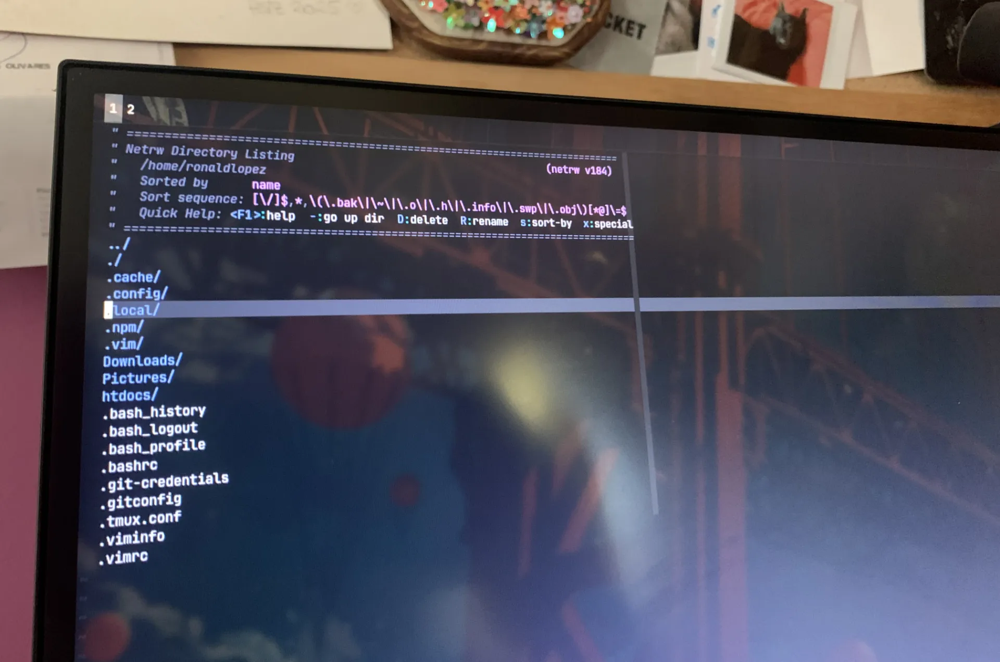

I did it. I finished tuning everything: Neovim, Tmux, Hyprland, Hyprpaper. I removed what I didn't need and kept the system as simple as possible. There were a few issues with Bluetooth and Wi-Fi, but nothing a `pacman` or a `journalctl` can't fix.

I also managed to set up Git, push a few commits, and tweak Waybar to keep it just as simple: no excessive colors or weird animations. At some point I wanted it to look like those Unix setups you see on Reddit, but in terms of usefulness I think it takes away more than it adds. I don't want to have to think that much about the environment, I want to act and have the machine keep up with me.

### Realizing something

When I finished setting up the whole thing, I realized something: Arch is basically a server-type distro, but with drivers and utilities to be used as a desktop computer. There are differences, sure, but it's similar to taking a Raspberry Pi with Ubuntu Server and adding support for a monitor, keyboard, and speakers. Nothing more, nothing less.

Understanding that disappointed me a little. Not because it's bad, but because the mystery disappears once you know what's behind it.

### Final thoughts

Beyond all that, it was a great experience. Installing things from scratch, enabling and disabling services, simplifying the system until I understood exactly what I had and what was missing, losing the fear of Arch as something only a wizard could install. I leaned heavily on Google, Reddit, and ChatGPT to get some things working, but the learning stays with you.

Would I recommend it? It depends. If you want to learn from the ground up, install things, and go through a rough time that's worth it, yes. But if you're going to end up configuring everything to look like Mac or Windows anyway, save yourself the trouble.

Thanks for reading, see you around. :)
