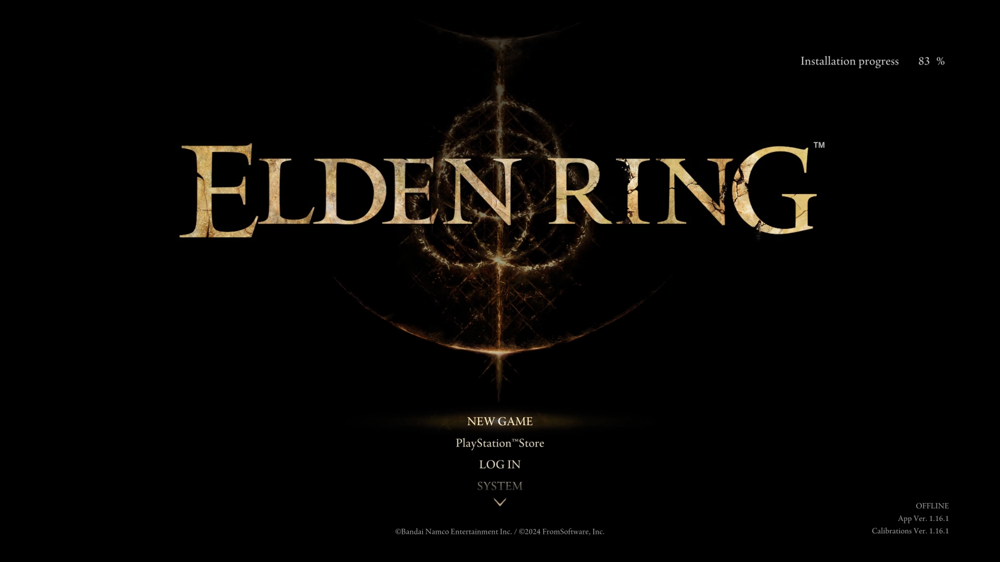

And Bloodborne is done. I finished the DLC. Killed Ludwig (my favorite boss) and the hardest one of all, the Orphan of Kos. It cost me my sanity, God, how I suffered with that boss. I spent about four days learning and memorizing his moveset, until the RNG finally sided with me and I pulled it off. After that, the rest was a walk in the park.

### An acquired taste

Honestly, Souls-type games never appealed to me enough to be the one playing them, but I did like watching gameplay, speedruns, and reading about the lore (it's like League of Legends: I like it, but I never felt it was something for me). After finishing Bloodborne on my own, all of that changed.

### From Yharnam to the Lands Between

One day I found myself looking up Souls-type games. I had Sekiro, Dark Souls 3, Lies of P, and Elden Ring in mind. In the end I kept it simple: whichever was cheapest would be next. And that's how I found Elden Ring (used) for 40 bucks on Mercado Libre. Well, sure, why not. Like with Bloodborne, I already knew the bosses, part of the lore, and the odd speedrun.

### First (many) hours

My first hours were pure learning. I struggled to get used to the timing. Unlike Bloodborne, Elden Ring has a slower pace: between attacks, dodges, and blocks, it made me feel kind of dumb at first, like someone telling me to shift down a gear while driving. After a few hours I "got used to it," although to this day it still trips me up.

That said, and with a couple of Graces activated, I got a horse that let me explore a good chunk of the first area (before reaching the first boss). Honestly it overwhelmed me a bit: so many paths, dungeons, mini-bosses. In the end I ended up doing everything except progressing the main story. It's not entirely bad, but when you lose focus, the story doesn't hit the same (or maybe that's just me).

Beyond that, it's been a great experience. I really like the atmosphere, the music, the lore (which I had to look up on YouTube and ask ChatGPT about) and the feeling of not knowing where to go because there are a thousand valid paths and others not so much.

Right now I'm exploring the post-Radahn area: the Eternal City. There's still a lot to explore and level up, but I'm taking it slow. No rush. I know it has to end at some point, but in the meantime, I'm enjoying it and losing my patience at my own pace.
