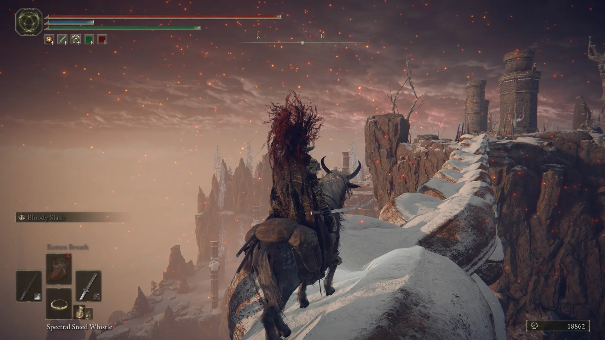

I did everything I felt like doing and had time for, maybe too much, for what was coming next. My plan was simple: use what the game gave me, not overthink builds, and level up whatever I had on hand. While Elden Ring offers hundreds of options for different classes, coming from Bloodborne I wanted to simplify everything and have my experience be more about learning movesets than optimizing my character.

### A feeling hard to explain

As I progressed, exploring made sense. I leveled up, upgraded weapons, got talismans, tears for the Physick, summons (most of them useless), and a bunch of items that promised to make me stronger. The game constantly rewarded me for straying from the main path.

But when I reached the final stretch, that feeling started to fade.

I felt like all the character progression started to matter a lot less than my ability to memorize patterns and execute an almost perfect fight. And that's when I started comparing it to Bloodborne.

### Bloodborne never changed the rules on me

In Bloodborne I learned something simple from the start: skill mattered, but so did the character. If I upgraded a weapon or leveled up, it showed. After defeating the Orphan of Kos, Gehrman, and the Moon Presence, I felt like every hour invested, every character upgrade, had reached a culmination. The effort was reflected in the outcome.

With Elden Ring, that didn't happen to me.

### Was all that exploring worth it?

That was the question that kept circling in my head after the credits rolled.

I spent many hours exploring so my character would be solid enough that taking hits wouldn't be so decisive. It was an implicit deal with the game: I give you time and dedication, and in exchange I don't want my character to die in the first two hits. The game steered me in that direction and I followed it.

The problem is that Malenia, Radagon, and the Elden Beast completely ignored that deal. Three bosses that demanded near-perfect precision, regardless of how much level or how many hours you had under your belt. All the accumulated progress stopped mattering.

### I didn't want the game to be easy, just clear about the rules

If you put me in an open world where you're telling me to level up, find better items, and explore, and then at the end you put three bosses that invalidate that progress, maybe from the start you should have weighted skill more heavily than exploration.

It's frustrating not having practiced certain combat patterns because your character was strong enough, only for the game to change the rules of the match at the end. Leveling up stopped making sense when an NPC kills you in two hits no matter how much you'd invested.

I felt cheated by a game that guides you in one direction and then discards that direction at the end.

### Anyway

Maybe I rushed into playing another Souls game, or maybe this one just wasn't for me at this point in time. I still think Bloodborne had clear rules from the start and kept them until the end. Elden Ring wasn't like that, and the bitter taste of having invested so much only for none of it to matter in the end dimmed a bit of the spark I carried over from Bloodborne.

It's not a bad game. But it was a bad farewell.
