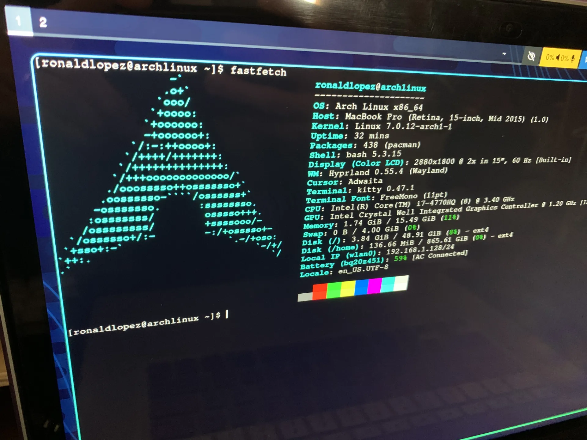

I finally took the leap to Arch. It was rushed, I'll admit, considering I'd installed Mint barely two weeks earlier (because Ubuntu gave me trouble), and after that time I realized I was doing the same thing I did on Mac: trying to emulate everything I already knew, just on a different operating system. And that wasn't what I wanted. I wanted to learn something new, use the terminal, not depend on so much graphical interface to get around.

It's similar to what happened to me when I made the jump to Neovim: I wanted something completely different, something that wouldn't make me depend on a file browser or anything so visual. You could ask why, if everything's already solved, isn't this just relearning something from scratch trying to optimize something you maybe didn't even need (I'll get into that in another post). For now, I managed to install Arch after the Wi-Fi gave me more than one headache, and install Hyprland and Waybar.

### Plenty left to do, too much...

I don't know why I keep ignoring the abstraction that programs and operating systems offer in favor of something more low-level. Maybe it's a mental issue, or maybe I just want to try different things. Who knows. For now things look good: I still need to configure the audio drivers, Bluetooth, the keyboard (a Corne), and whatever else is left to discover.

This time I'm going to try to do things differently. Make the process like Neovim's: use the terminal more, navigate with it, move and delete files without depending on a folder interface. That's what Arch is for, otherwise I'd have stayed with Mac.

More than fun, I expect all of this to be chaotic. Installing stuff that doesn't work, breaking the system, reinstalling everything. That's part of the process, and it's partly why I'm here, about to step into the unknown.
