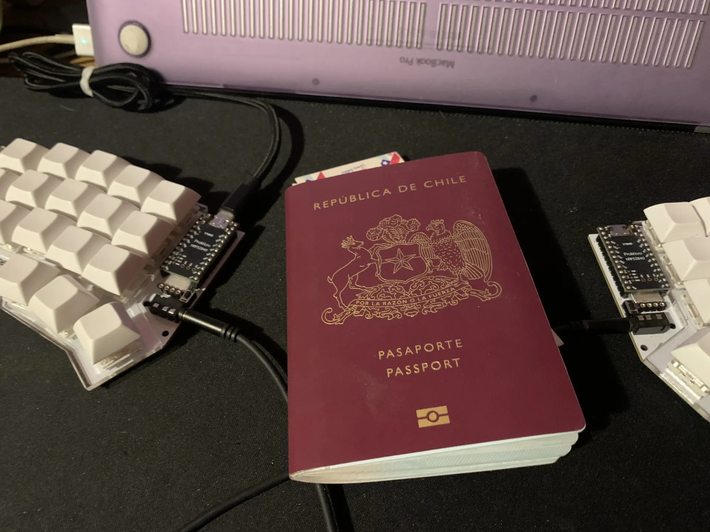

For a few years now I've been asking myself why, as developers (and sometimes as people), we tend to marry ourselves so tightly to one particular thing. It doesn't just happen in programming: you're frontend and it seems like backend is forbidden, or something from another world that would take eons to understand. It happens with music too: I like one style, and if I listen to another, I feel like a traitor to my own taste. And so on with plenty of other things.

But what would happen if you explored other ways of programming, other musical styles, other genres you think you don't like and they end up being the best thing you could have done? They say leaving your comfort zone is good, but it's not always easy. Sometimes it's uncomfortable, other times it's frustrating, but if you do it with an open mind and no prejudice, it's usually worth it.

### From React Native to native

With that idea in mind, and with some experience in React Native, I decided to explore native development: Android with Kotlin and iOS with Swift. The idea is simple: explore and learn. I don't plan on becoming senior at either one, or shipping an app that makes millions in a couple of days. More like taking my time and exploring, like a game with lore that invites you to read the dialogue, that doesn't rush you to the finish line but invites you to enjoy the road.

### It's about the experiences

There's a pretty cliché phrase that says the journey matters more than the destination, and that's kind of how I see it. It's like traveling to a new country: you have fears and doubts, but you're not going to become an expert on that place, you want to get to know it, take your time, and make every experience count.

And I realized that's the kind of developer I like being: an explorer. One who learns from every experience, every project, and every mistake. One who doesn't worry too much about being boxed into a label, and who enjoys the process, not just the result.
