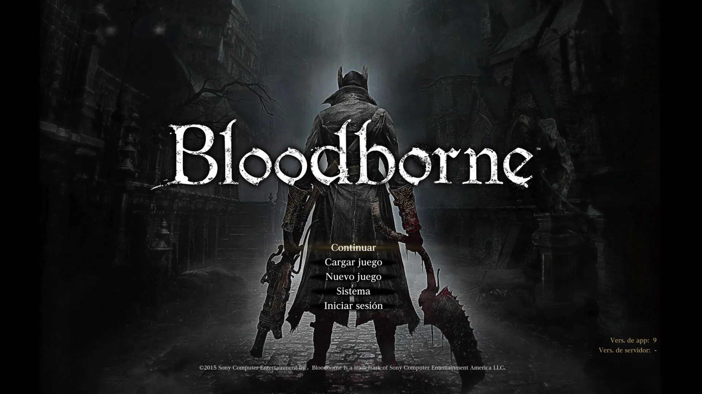

Years ago, while looking for a new game to sink my time into, I came across Bloodborne. I'd already seen bits of it, mainly its Victorian aesthetic and dark atmosphere, but beyond that, the twisted design of its bosses really caught my attention. My favorite was Ludwig: his design, transformations, dialogue, and music were something I simply couldn't ignore. So when I found the game cheap on the PS4 Store, I decided to give it a shot.

### From fun to frustration

I already knew what playing a SoulsLike meant. Needless to say, I'd read and heard comments to the point of exhaustion that it wasn't a game for everyone, that it was very hard, that it killed you a lot, that you had to learn from your mistakes. But honestly, I wasn't prepared for any of it.

I gave it a couple of hours to see if the game and I could become good friends. I wanted to like it because something about it had hooked me — the bosses — and the goal was clear: reach Ludwig and live the same experience I had the first time I saw him, but this time in control.

Huge mistake. I didn't understand the game or its mechanics. There were no tutorials, nobody holds your hand, you don't know what to use or where to go. I spent about three hours trying to figure it out (I should have looked up a tutorial), but I wanted to discover it on my own, and that led me to die over and over, to get frustrated, to feel like the game wasn't for me, that it was unfair. I left it there, without even having killed the first boss, out of pure frustration.

### Another chance, another me

Years after abandoning it, I wanted to give it another shot. This time with the mindset that it wasn't going to be easy, that I was going to die a lot, but that it was part of the process. I started over with the same dream of reaching Ludwig, and I think I had changed over time, because now everything clicked: the parries, the transformations, the levels. That said, this time I watched a few tutorials and read some of the lore to understand what was going on.

I was fascinated. It was a completely different experience from any other game. Killing a boss was hard — although you could level up to make it more manageable — but the satisfaction of pulling it off is like nothing else. Every boss had its own personality, its own fighting style, its own story, and that made every victory feel special. Same with the environment: I learned to check the corners, under the stairs, the rooftops, to find items and secrets (although at some point I found it tedious, haha). This time the game and I understood each other, and every time I died I knew it was my fault, that I had to learn and keep going. That kept me motivated to continue.

### Ludwig, Lady Maria, Kos, and the end of the hunter's journey

I fought and killed everything in my path until I reached Ludwig, and the experience was as good as I imagined: the music, the boss, the atmosphere, his dialogue — everything was perfect. I think I died about fifty times before killing him, but for some reason I had a great time. Every death was a lesson, a "I should have done this differently, next time I'll do it another way." Same with Lady Maria and Kos, the hardest one in the game. Once I got past those three, the rest was a walk in the park. Nothing could stop me, not even the Moon Presence, the final boss.

As a conclusion, I think that just like there are things you're not ready for in the moment, my experience with Bloodborne was exactly that. I wasn't ready to play it until I actually was. I wouldn't play it again because it's not the same anymore, but giving it another chance was a good call. Would I recommend it? Not for everyone, because it tests your patience and your ability to learn from mistakes. But if you're someone who enjoys challenges, exploration, and story, it's definitely worth it.
