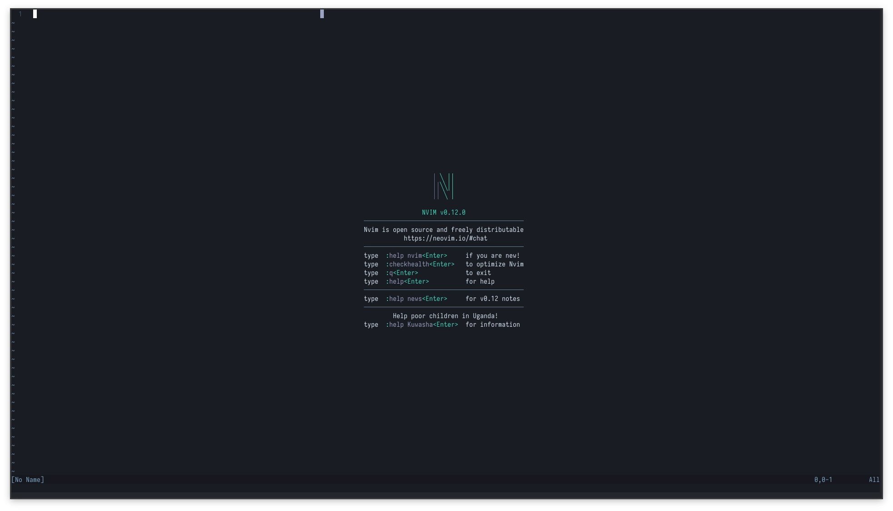
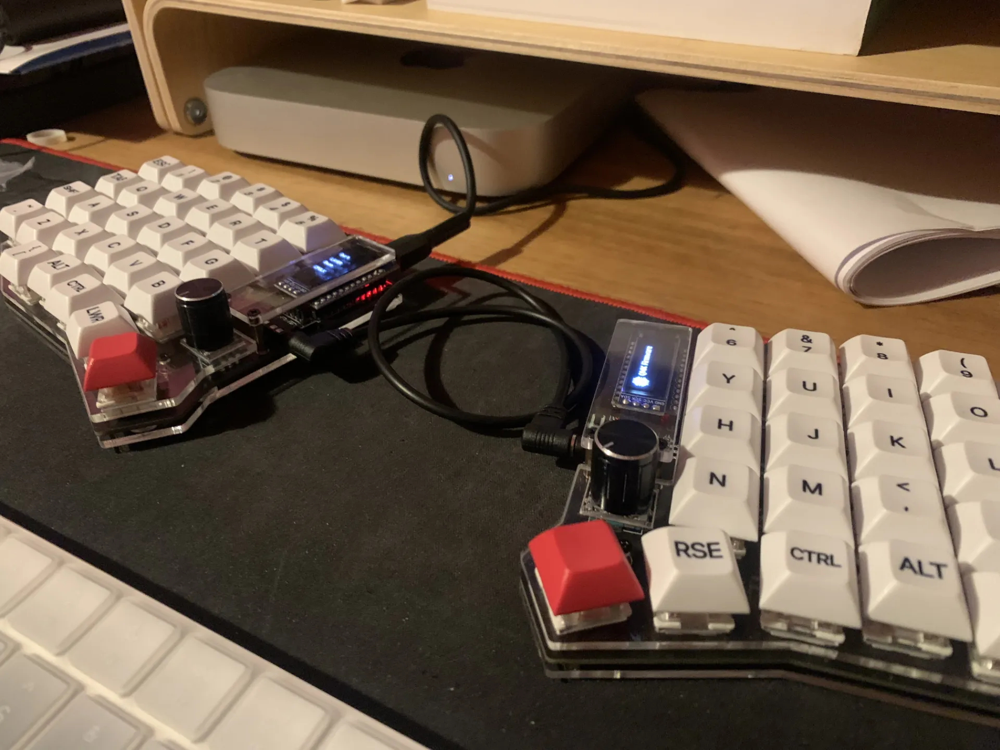

### The first step toward the terminal

It was 2023 or 2024, I don't quite remember, but I was tired of always doing the same thing in programming: VS Code, JS, React, TypeScript, always the same. I wanted to try something different, something that would bring back my passion for coding and the drive to learn new things.

That's when [ThePrimeagen](https://www.youtube.com/c/theprimeagen) showed up, with a coding style completely different from the traditional one, where everything was a boring YouTube tutorial teaching you how to build a CRUD in VS Code. This guy was really good at what he did, but there was something odd: a keyboard split in two, and his editor wasn't VS Code but one in the terminal, like something out of the Matrix. I was impressed. I watched a lot of his videos and couldn't understand how he moved between editors and files without using the mouse. I'd heard something about it years before, but this was the first time I saw someone do it so fluidly and so fast.

And something inside me said: this is what I'm missing. Not more CRUDs or projects that would take me to the same place as everyone else, but something that would genuinely push me out of my comfort zone. And so I started.

### My first contact with a split keyboard and Neovim

Since I had no idea about the terminal (beyond running `npm install` and stuff like that) and even less about split keyboards, I looked into whether Chile sold anything so I wouldn't have to buy from abroad. That's where I found Zone Keyboards, with a range of affordable options, so I went with the least aggressive one: a Sofle RGB, my first split keyboard.

I think it took me almost a full year before I mastered it 100%: typing without looking at every key, learning new shortcuts, using all my fingers, getting used to the new hand position. But after that, everything was faster. I didn't have to think about every move, I didn't have to hit `Cmd + Shift` to search for which app to open. It was think it, do it, no pauses, just execution. It was wonderful.

### From comfort to frustration

The next step was missing: learning to use the terminal. I realized the editor was called Vim and that it came bundled with almost every operating system, but ThePrimeagen used Neovim, which is basically the same thing on steroids. I installed it and after a few failures I understood it was going to take another couple of months to learn, but this time I was more motivated. Me and `.whatever` config folders became best friends, now I was making and unmaking things myself, without depending on some random VS Code plugin.

Several times I came across ready-made configs, but that was my moment to say: no, I want to understand this from the inside. I want to know why, when, and for what purpose each thing runs, not just install it and move on.

### From here on

Now my days are 100% Neovim. VS Code is something I look at fondly, but I don't plan on going back to the mouse or messing up a text selection because my hand shakes. A `V + i + ""` and done. My friends think I'm crazy for using that editor and a keyboard (now a Corne V3) with no symbols on the keys, but for me it's the best thing that could have happened: it's comfortable and I like it.

Now I'm into Linux and other things, but that's a story for another post. For now, I'm happy with my setup, Neovim, and my Corne V3.
