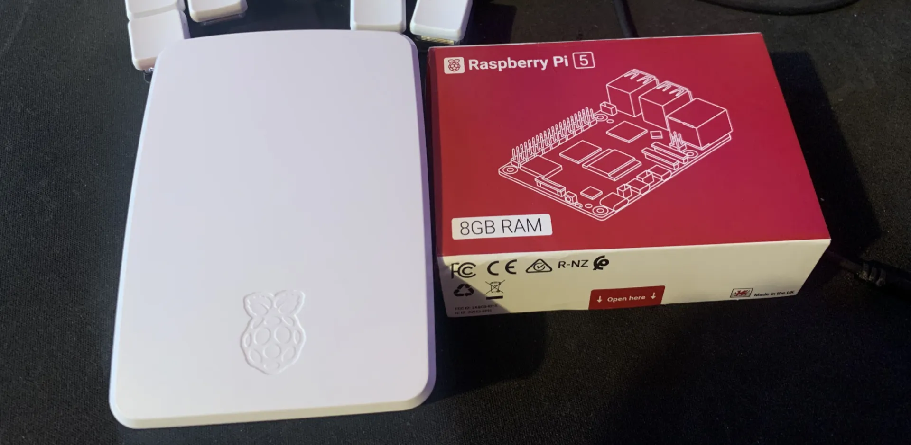

As a programmer, I've always been curious about servers (or "servers", which sounds cooler). I thought they were some strange thing full of cables sitting in some ethereal corner of the internet, that only backend folks and experts had access to and understood. Later on, when I got a bit tired of frontend, I set out to investigate what servers, 500 errors, infrastructure, architecture, and all of that were really about.

The only thing I had in my head was that servers were hallways full of racks with lights and cables. Beyond that, who knows what dark magic was brewing to give birth to the internet.

### Curiosity as my battle horse

My curiosity took me to strange, inhospitable places: terminals, protocols, firewalls, and a ton of things that made no sense to me. I have this mental method of abstracting everything as much as possible so I don't lose my mind. That's what happened to me with frontend: something like, the browser is a program that reads `.html`, `.css`, `.js`, and other files (just like Excel reads `.xlsx` or `.csv`). Simple and digestible. Excel files have their own way of being written and the browser has its own: Excel has macros, cells, and columns; the browser has tags, a console, and a ton of other things. I wanted servers to make the same kind of sense to me.

### My first (chaotic) approach

The first thing I did was dive into AWS. Everyone used it (where I work, they used it until not long ago) and I wanted to understand how it worked. So with a video from the internet and a couple of errors, I spun up my own server, managed to connect via SSH, and installed Apache to have a web server.

That whole journey taught me the basics: a server is a computer among many computers, mounted on racks in data centers spread across several countries, with the difference that those machines don't have monitors or a mouse, they run a minimal operating system (no sound drivers, no Bluetooth, none of that), and you connect via terminal with SSH. From there you can do whatever you want. That's where I learned to navigate between files, install things, and lay the groundwork for what came next.

### Not everything that shines is gold, and to have gold you have to pay for it

After getting everything up and running, I realized you had to pay if you used certain things. At one point I thought: if I forget to turn something off, they're going to charge me. On the surface it sounds cool to have a server running on AWS, but when the bill shows up, it's a different story. One slip and I had to pay around 50 USD.

That's when YouTube recommended me a topic: homelabs. Video after video, I realized I could have my own home server without paying anything. It didn't sound as cool as "I have a server on AWS," but it was free and I could make and unmake it however I wanted.

### Raspberry Pi, the start of it all

I bought a Raspberry Pi 5 and from there it was basically the same as AWS, just on my own. On AWS you have several ISOs to install whatever operating system you want; here it was Ubuntu and that's it. So that's what I did: installed Ubuntu Server, installed Apache, dropped in an `index.html`, and done. I had everything I needed for my own home server.

Several things happened after that, like the server dying because I installed a corrupted program, losing everything, and having to redo it all from scratch. But I learned a lot more from those mistakes than from any course online.

### Final thoughts and the other side of the coin

I finally understood that a server isn't dark magic or knowledge reserved for a select few. It's a computer with a simpler operating system, serving a different purpose, that in some cases requires the terminal to make changes, and that isn't as complicated as it seems at first.

Along the way I also learned to do some automatic deploys with GitHub Actions, use Docker, and get a first taste of Kubernetes. I didn't become an expert, but I understood enough to not feel intimidated by that side of things anymore. And to this day I'm still learning and experimenting. I can delete, reinstall, and start over, and that's what I like the most: not being afraid to break something, because you can always start again.
