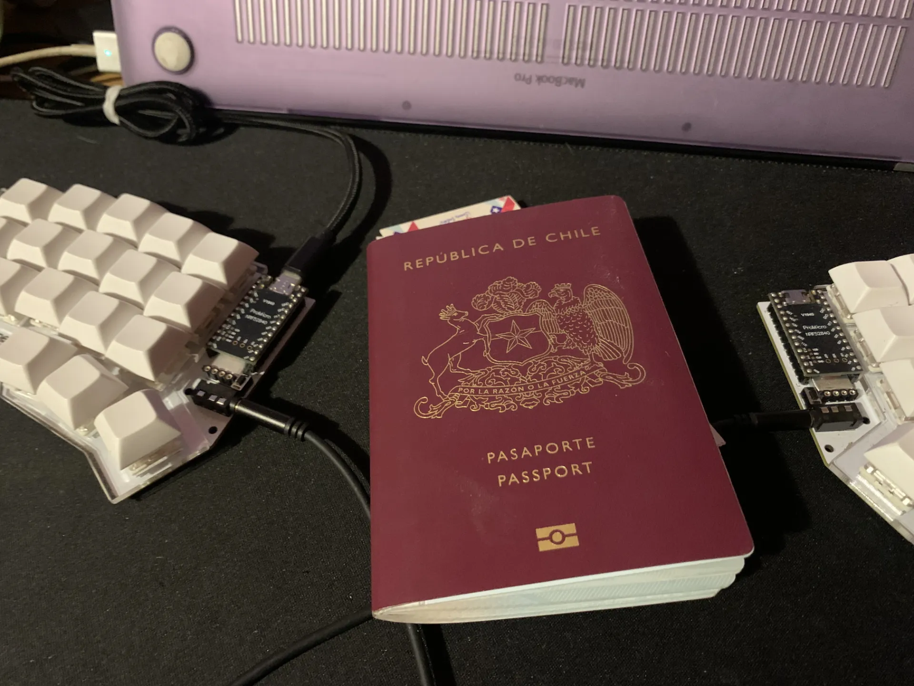

Desde hace algunos años me he estado cuestionando por qué, como programadores (y a veces como personas), tendemos a casarnos tanto con un tema en particular. No solo pasa en la programación: eres frontend y parece que el backend estuviera prohibido o fuera algo de otro mundo que costaría eones entender. También pasa con la música: me gusta un estilo y si escucho otro, parezco un traidor a mi propio gusto. Y así con muchas cosas más.

Pero ¿qué pasaría si exploraras otras formas de programar, otros estilos musicales, otros géneros que piensas que no te gustan y terminan siendo lo mejor que pudiste haber hecho? Dicen que salir de la zona de confort es bueno, pero no siempre es fácil. A veces es incómodo y otras veces es frustrante, pero si lo haces con la mente abierta y sin prejuicios, suele valer la pena.

### De React Native a nativo

Con esa idea en mente y con algo de experiencia en React Native, decidí explorar el desarrollo nativo: Android con Kotlin e iOS con Swift. La idea es simple: explorar y aprender. No pienso volverme senior en ninguno de los dos, ni lanzar una app que genere millones en un par de días. Más bien tomarme el tiempo y explorar, como si fuera un juego con un lore que te invita a leer los diálogos, que no te apura para llegar a la meta sino que te invita a disfrutar el camino.

### Son las experiencias

Hay una frase bastante cliché que dice que el camino es más importante que la meta, y lo veo algo así. Es como viajar a un país nuevo: tienes miedo e inquietudes, pero no vas a volverte experto en ese lugar, quieres conocerlo, tomarte el tiempo y hacer que cada experiencia cuente.

Y caí en la cuenta de que ese es el tipo de desarrollador que me gusta ser: un explorador. Que aprende de cada experiencia, cada proyecto y cada error. Que no le preocupa demasiado encasillarse en una etiqueta, y que disfruta del proceso, no solo del resultado.
