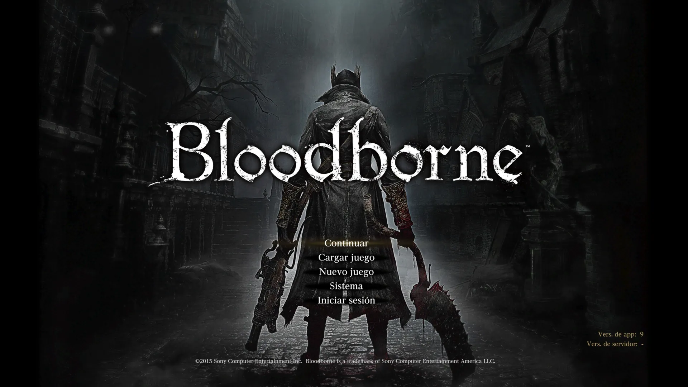

Hay juegos que envejecen. Y hay juegos que maduran. **Bloodborne** claramente es de los segundos.

Lanzado en 2015 exclusivamente para PS4, el título de FromSoftware sigue siendo uno de los mejores action-RPGs jamás creados, y en 2026 —con más de una década encima— su propuesta se siente igual de fresca, brutal y absorbente que el primer día.

### El lore: una pesadilla con capas

Bloodborne transcurre en **Yharnam**, una ciudad victoriana gótica donde los habitantes han sido infectados por una enfermedad de la sangre que los convierte en bestias. Llegas como un cazador buscando curación, y terminas enredado en algo mucho más profundo.

El lore no te lo cuentan directamente. Está escondido en descripciones de objetos, en la arquitectura, en los nombres de los enemigos. Cuanto más prestas atención, más inquietante se vuelve todo. La influencia de **H.P. Lovecraft** es brutal: hay cultos, entidades cósmicas, conocimiento que destruye la mente, y una delgada línea entre la locura y la iluminación.

No es un lore para todo el mundo, pero si te engancha, es de esos que te quedas pensando días.

### La jugabilidad: agresividad como mecánica

Si vienes de otros Souls, olvida la estrategia de escudo y paciencia. Bloodborne te obliga a **atacar**. Quedarte quieto es morir. El sistema de rally te permite recuperar vida perdida si contraatacas rápido, lo que genera un loop de combate tenso, fluido y adictivo.

Las armas transformables (las llamadas _trick weapons_) son otro punto alto: cada una tiene dos formas con moveset completamente distinto. Una espada que se convierte en látigo, un cuchillo que se abre en hoz, un mazo enorme que se separa en cadenas. Son pocas armas pero cada una se siente única.

Los jefes son el verdadero plato fuerte. Algunos te van a matar decenas de veces. Ninguno se siente injusto.

### ¿Vale jugarlo en 2026?

**Sí, con matices.**

El juego sigue siendo una obra maestra en términos de diseño, arte y atmósfera. Visualmente aguanta bien, aunque la resolución y los frames por segundo muestran su edad si vienes de juegos modernos (corre a 30fps en PS4 y PS5 sin parche oficial de 60fps, lo cual sigue siendo un tema de conversación en la comunidad).

Si tienes paciencia para la curva de aprendizaje y te gusta explorar sin que te lleven de la mano, es una experiencia que difícilmente vas a olvidar. Si buscas algo más accesible o narrativamente explícito, puede frustrarte.

Lo que sí es seguro: no hay otro juego que se sienta exactamente igual a Bloodborne. Y eso, en 2026, sigue siendo suficiente razón para jugarlo.

> _"La cacería debe continuar."_
