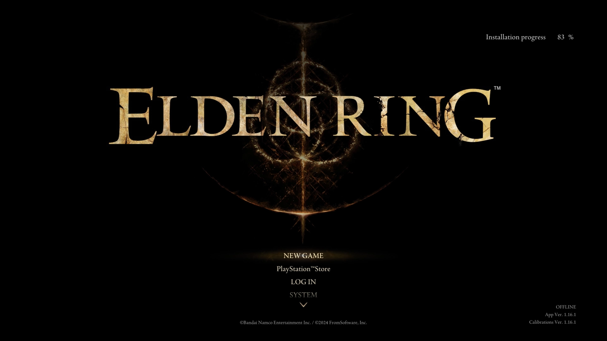

Terminé Bloodborne. Terminé el DLC. Maté a Ludwig, sobreviví la Pesadilla, limpié Yharnam de todo lo que me pusieron enfrente. Y en lugar de tomarme un descanso, abrí Elden Ring.

Todavía no sé bien qué pensar. Y creo que eso es parte de la experiencia.

### Sales al campo y no hay techo

Lo primero que te impacta cuando vienes de Bloodborne es la escala del mundo. Yharnam era una ciudad laberíntica, densa, construida hacia adentro. Cada callejón te llevaba a otro callejón que de alguna forma volvía al inicio. Era diseño de niveles puro, casi musical.

Las Tierras Intermedias son otra cosa completamente. Sales de la Capilla Semienterrada y hay un campo enorme frente a ti. Sin marcadores. Sin un NPC que te diga a dónde ir. Solo pasto, ruinas a lo lejos, y ese árbol dorado gigante en el horizonte que claramente es importante, pero nadie te lo confirma.

La primera reacción fue desorientación. La segunda fue curiosidad. La tercera fue morir a manos de un jinete que claramente no tenía que enfrentar todavía.

### El combate se siente distinto, y todavía me estoy adaptando

Bloodborne te entrena para ser agresivo. El rally, la velocidad, la presión constante de ir hacia adelante. Ese músculo queda muy marcado después de decenas de horas.

Aquí el combate es más lento, más pesado. La primera hora estuve esquivando en los momentos equivocados y atacando cuando no debía, esperando una ventana de rally que nunca llegó. Todavía no llegué a los jefes principales — estoy explorando, muriendo contra enemigos de campo, aprendiendo a leer el ritmo del juego.

No sé si me va a gustar más o menos que Bloodborne. Todavía es muy pronto para saberlo.

### Torrent y la promesa de lo que viene

Llegué a la gracia donde te entregan a Torrent, el caballo espectral, y algo hizo clic.

No sé si fue el momento en sí o lo que implica: que el mundo es tan grande que necesitas montura para atravesarlo. Que hay lugares que todavía no puedo ver pero que existen. Que la promesa de lo que viene es enorme.

Por ahora solo estoy al principio. Más preguntas que respuestas, más muertes que victorias, y una lista mental de lugares que vi desde lejos y que quiero explorar.

Si eso es señal de algo, creo que es buena señal.
