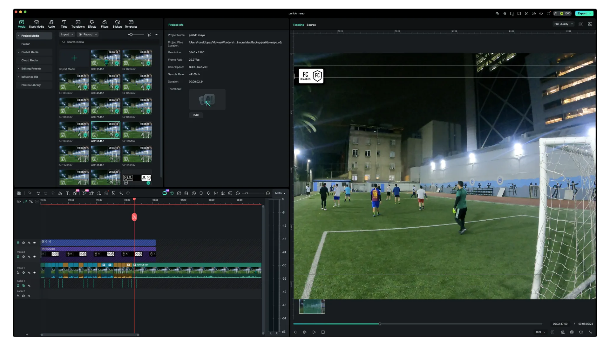

Empecé a jugar de arquero en agosto de 2025. Casi desde el primer partido, puse una cámara al costado del arco para ver mis propios errores.

Cuando estás bajo el arco, hay cosas que no percibes en el momento — la posición de los pies, la salida tarde, la distancia mal calculada en un cruce. La memoria no alcanza. El video sí.

### El setup: una GoPro Hero 9 al costado del arco

La cámara va montada en un ángulo que captura la mayor parte del área. Nada elaborado, solo funcional. La idea siempre fue tener el registro, no hacer cinematografía.

El problema al principio era el tiempo. Ver el material completo, identificar las jugadas que valían la pena, recortarlas, armarlas en algo coherente tomaba alrededor de tres horas. Entre revisar y re-revisar cada escena para decidir si servía, el proceso se estiraba más de lo razonable.

Con el tiempo fui ordenando el flujo de trabajo. Ahora la selección de material toma cerca de una hora, y la postproducción otros treinta minutos. Es la misma tarea, pero con criterio acumulado.

### Filmora y el aprendizaje que viene de la repetición

Uso Wondershare Filmora para editar. Ya tenía algo de experiencia antes, pero el ritmo constante de material — un partido por semana, a veces más — aceleró bastante las cosas.

Cuando editas seguido, las decisiones que antes tomaban tiempo se vuelven más rápidas. Qué corte funciona, cuándo acelerar una jugada, cómo armar el ritmo de un highlight para que no se sienta plano. Son cosas que se aprenden repitiendo, no leyendo.

El canal de YouTube fue la consecuencia natural de tener el material y saber qué hacer con él.

### Lo que el video le hace al juego

Ver los partidos grabados cambia cómo te percibes como jugador. Hay errores que en el momento no registras y en pantalla son evidentes. Hay buenas jugadas que tampoco reconoces hasta verlas desde afuera.

Llevo casi un año con este proceso. El flujo de trabajo sigue mejorando, el criterio de edición también. Y el canal sigue creciendo, un highlight a la vez.
