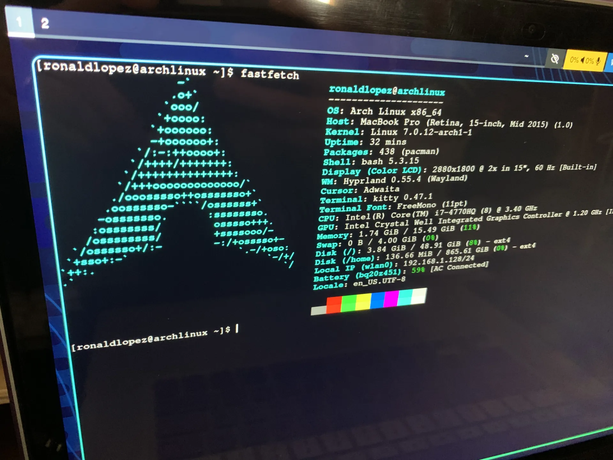

Finalmente di el salto hacia Arch. Fue apresurado, hay que decirlo, considerando que hace apenas dos semanas había instalado Mint (porque Ubuntu dio problemas) y después de ese tiempo me di cuenta de que estaba haciendo lo mismo que hacía en Mac: intentando emular todo lo que ya conocía, pero en otro sistema operativo. Y eso no era lo que quería. Quería aprender algo nuevo, usar la terminal, no depender de tanta interfaz gráfica para moverme.

Es parecido a lo que me pasó cuando di el salto a Neovim: quería algo completamente diferente, algo que no me hiciera depender de un navegador de archivos ni de nada tan visual. Uno podría preguntar para qué, si ya está todo resuelto, que es volver a aprender algo desde cero buscando optimizar algo que quizás ni siquiera lo necesitaba (de eso hablaré en otro post). Por ahora, logré instalar Arch después de que el Wi-Fi me diera más de un dolor de cabeza, e instalar Hyprland y Waybar.

### Harto por hacer, demasiado...

No sé por qué sigo ignorando la abstracción de los programas y sistemas operativos para buscar algo más de bajo nivel. Quizás es un problema mental, o quizás simplemente quiero probar cosas diferentes. Quién sabe. De momento la cosa se ve bien: queda configurar los drivers de audio, el Bluetooth, el teclado (un Corne) y lo que sea que falte por descubrir.

Esta vez voy a intentar hacer las cosas diferente. Que el proceso sea como el de Neovim: usar más la terminal, navegar con ella, mover y eliminar archivos sin depender de una interfaz de carpetas. Para eso está Arch, si no me quedaba con Mac.

Más que diversión, espero que todo sea caótico. Instalar cosas que no sirvan, romper el sistema, reinstalar todo. Eso es parte del proceso, y en parte es por lo que estoy acá, a punto de adentrarme en lo desconocido.

