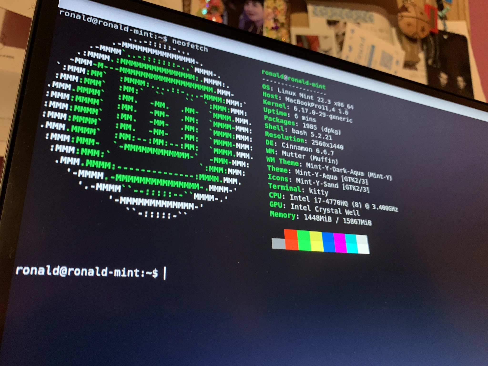

Tengo una MacBook Pro 2015 que llevaba tiempo guardada. En lugar de dejarla acumulando polvo, decidí hacer algo con ella: instalar Linux. No como experimento temporal, sino como el primer paso de un camino que termina en Arch Linux.

Empecé por Linux Mint. Y fue más interesante de lo que esperaba.

### Por qué Mint y por qué en una Mac

Linux Mint es consistentemente recomendado como punto de entrada para quienes vienen de otros sistemas. Interfaz familiar, buena documentación, comunidad activa. Para alguien que nunca había instalado Linux en su vida, tenía sentido no empezar por el modo difícil.

La MacBook Pro 2015 es un hardware particular. Apple no diseña sus equipos pensando en otros sistemas operativos, y había cierta incertidumbre sobre qué iba a funcionar y qué no. El wifi, la pantalla Retina, el trackpad — todo podía ser un problema.

Resultó que no fue tan dramático. Pero tampoco fue perfecto.

### La instalación: algunos tropiezos, pero salió

El proceso en general funcionó. Crear el USB booteable, entrar al gestor de arranque, seguir el instalador de Mint — nada de eso fue un obstáculo mayor.

Los tropiezos llegaron en los detalles. Cosas pequeñas que no funcionaron al primer intento y que requirieron buscar, leer foros, probar. Nada crítico, pero suficiente para recordarte que estás fuera del ecosistema controlado al que Apple te tiene acostumbrado.

Esa diferencia se siente. Y es parte del punto.

### Lo que más impacta: no es macOS

Arrancar Linux Mint por primera vez en una Mac es una experiencia extraña. El hardware es el mismo. La pantalla, el teclado, el trackpad — todo igual. Pero el sistema que corre encima es completamente diferente.

No es solo visual. Es la lógica detrás de todo. Cómo está organizado el sistema de archivos, cómo se instalan programas, cómo interactúa el usuario con la máquina. macOS te abstrae de casi todo. Linux Mint te abstrae menos, y eso se nota desde el primer momento.

Para alguien acostumbrado al ecosistema de Apple, la sensación inicial es de extrañeza. Después, poco a poco, empieza a convertirse en curiosidad.

### Arch Linux como destino

La razón por la que empecé este camino no es usar Linux Mint indefinidamente. Es entender Linux a fondo.

Arch Linux es conocido por su filosofía de instalación manual: no hay asistente que tome decisiones por ti. Cada componente del sistema lo configuras tú, y eso te obliga a entender qué hace cada parte. Es el tipo de aprendizaje que no se puede atajar.

Linux Mint es el paso intermedio. Un lugar donde familiarizarse con el sistema, con la terminal, con la forma de pensar de Linux, antes de enfrentarse a algo que requiere más conocimiento base.

Por ahora estoy aquí. Aprendiendo lo básico, rompiendo cosas, leyendo documentación.

Arch puede esperar. Todavía tengo mucho que aprender en este paso.
