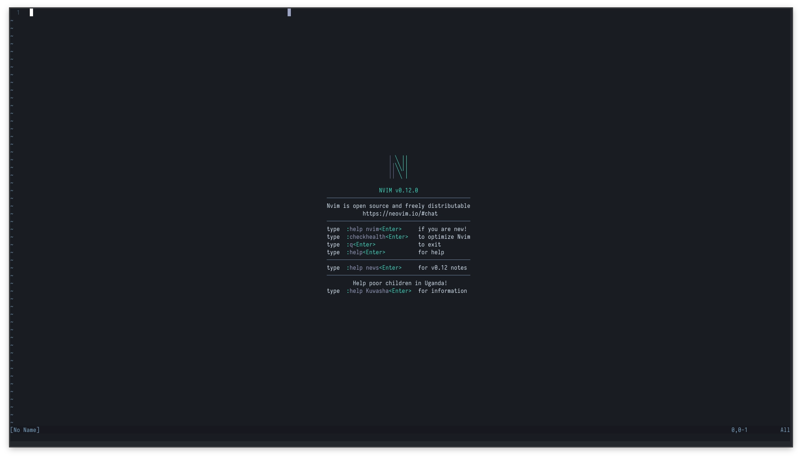
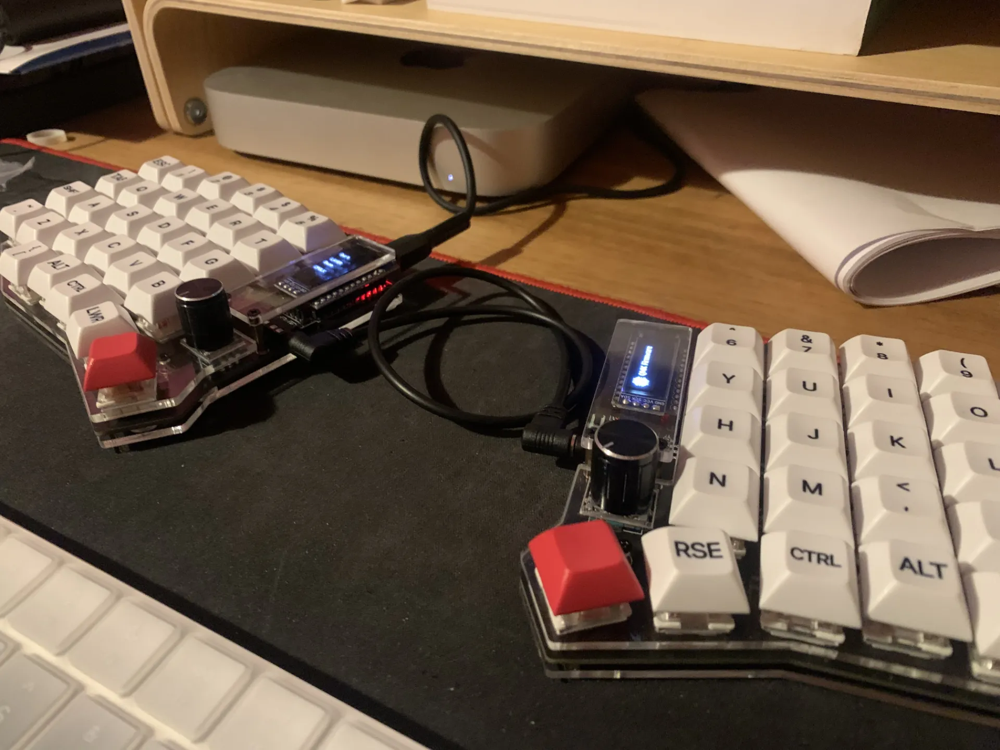

### El primer paso hacia la terminal

Corría el año 2023 o 2024, ya no recuerdo bien, pero estaba aburrido de hacer siempre lo mismo en programación: VS Code, JS, React, TypeScript, siempre lo mismo. Quería probar algo diferente, algo que me hiciera recuperar la pasión por programar y las ganas de aprender cosas nuevas.

Ahí apareció [ThePrimeagen](https://www.youtube.com/c/theprimeagen) y un estilo de programación completamente diferente al tradicional, donde todo era un tutorial aburrido de YouTube que te enseñaba a hacer un CRUD en VS Code. Este tipo era muy bueno en lo que hacía, pero tenía algo raro: un teclado partido en dos, y su editor no era VS Code sino uno en la terminal, como en la Matrix. Quedé impresionado. Vi muchos de sus videos y no entendía cómo se movía entre editores y archivos sin usar el mouse. Ya había escuchado algo al respecto años antes, pero era la primera vez que veía a alguien hacerlo tan fluido y tan rápido.

Y algo en mí dijo: esto es lo que me falta. No seguir haciendo CRUDs ni proyectos que me llevarían al mismo lugar que todos, sino algo que me motivara a salir de verdad de mi zona de confort. Y entonces empecé.

### Mi primer contacto con un teclado split y Neovim

Como no tenía idea de la terminal (más allá de hacer `npm install` y cosas así) y menos de teclados separados, busqué si en Chile vendían algo para no tener que comprar afuera. Ahí encontré Zone Keyboards, con opciones variadas y accesibles, así que me lancé por lo menos agresivo: un Sofle RGB, mi primer teclado split.

Creo haber estado casi un año completo antes de dominarlo al 100%: escribir sin mirar cada tecla, aprender atajos nuevos, usar todos los dedos, acostumbrarme a la nueva posición de las manos. Pero después de eso, todo era más rápido. No tenía que pensar en cada movimiento, no tenía que hacer `Cmd + Shift` para buscar qué programa abrir. Se pensaba y se ejecutaba, nada de pausas, solo ejecutar. Era maravilloso.

### De la comodidad a la frustración

Faltaba el siguiente paso: aprender a usar la terminal. Me di cuenta de que el editor se llamaba Vim y que venía en casi todos los sistemas operativos, pero ThePrimeagen usaba Neovim, que es básicamente lo mismo pero con esteroides. Lo instalé y después de algunos fallos entendí que me iba a tomar otro par de meses aprender, pero esta vez estaba más motivado. Yo y las carpetas `.algo` éramos mejores amigos, ahora yo hacía y deshacía, sin depender de algún plugin raro de VS Code.

En varios momentos me topé con configuraciones ya hechas, pero ese era mi momento de decir: no, esto lo entiendo yo desde adentro. Quiero saber por qué, cuándo y para qué se ejecuta cada cosa, no simplemente instalar y ya.

### De aquí en adelante

Ahora mis días son 100% Neovim. VS Code es algo que miro con cariño, pero no pienso volver a usar el mouse ni a fallar la selección de texto porque mi pulso es un desastre. Un `V + i + ""` y listo. Mis amigos creen que estoy loco por usar ese editor y un teclado (ahora un Corne V3) sin símbolos en las teclas, pero para mí es lo mejor que me pudo pasar: es cómodo y me gusta.

Ahora estoy con Linux y otras cosas, pero eso ya es historia para otro post. De momento, estoy feliz con mi configuración, Neovim y mi Corne V3.
