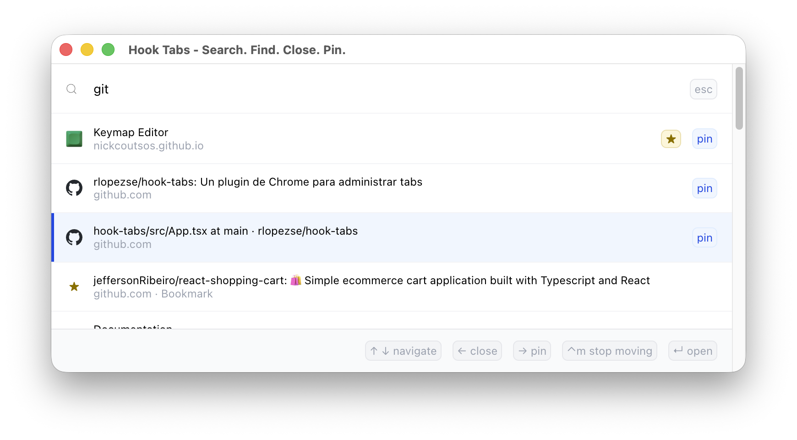

Estas últimas semanas estuve pensando en qué proyecto personal podría hacer que me aportara algo en la vida real. No solo un proyecto deployado con Cloudflare y Firebase, sino algo tangible de mi día a día, que me hiciera decir: esto lo armé yo y me sirve. No quería reinventar la rueda ni crear mi propio sistema operativo, pero sí algo pequeño y concreto que resolviera un problema real. Y así llegué a la idea de crear un plugin minimalista para Google Chrome que me permitiera buscar, anclar, marcar, cerrar y mover las pestañas que tengo abiertas en el navegador.

### Buscando inspiración

Además de ser fanático de Raycast, también lo soy de Neovim y su plugin Harpoon 2, que permite abrir archivos y moverse entre ellos de manera rápida y sencilla. Con esa idea en mente y mi necesidad de no usar el mouse cuando uso Chrome, navego entre apps y todo lo relacionado a mi Mac o Arch, el concepto estaba claro.

### Un plugin minimalista para Chrome

Lo primero era hacer algo simple, sin adornos, que resolviera el problema rápido. Usando React y TypeScript lo creé, lo probé y funcionaba, pero no era exactamente lo que quería. Chrome maneja las ventanas del navegador y las abre desde el ícono del plugin, no donde yo quería: al centro de la pantalla. No quería que la vista se fuera a un extremo, así que entre investigación y consultas, encontré que la solución era levantar una ventana separada sobre el navegador, sin otras opciones, como una app de escritorio. Y así salió la versión 0.0.1.

### Los primeros problemas

La primera versión funcionaba, pero había mucho por pulir y repensar. Quería darle estilo, algo familiar, íconos, que se viera bien. Con todo eso en mente, en unas semanas pasé de la 0.1 a la V1, y ese fue el primer paso para pensar en publicarlo oficialmente en la Chrome Web Store.

Nunca había publicado nada y tenía miedo de hacerlo. Pero me lancé: llené formularios, pagué la cuota correspondiente y esperé la revisión de Google. Y así llegué a la versión 1.0.0, que ya está disponible en la Chrome Web Store.

### De ahora en adelante

Después de publicar, le agregué algunas funcionalidades adicionales: buscar entre bookmarks (idea de mi esposa) y reubicar pestañas en el navegador. Con la versión 1.2.1, que está oficialmente "terminada" por ahora, tengo 7 usuarios. No es mucho, pero me siento orgulloso de haberlo hecho y de que alguien más lo use y le sirva. No es un proyecto grande ni ambicioso, pero resuelve algo real para mí y para otros, y eso es lo importante.

Si llegaste hasta acá y quieres probarlo, está disponible en la Chrome Web Store: [Hook Tabs](https://chromewebstore.google.com/detail/hook-tabs/fgjphkmaeoajpoadgdcconamlfapjobp?authuser=0&hl=en).
