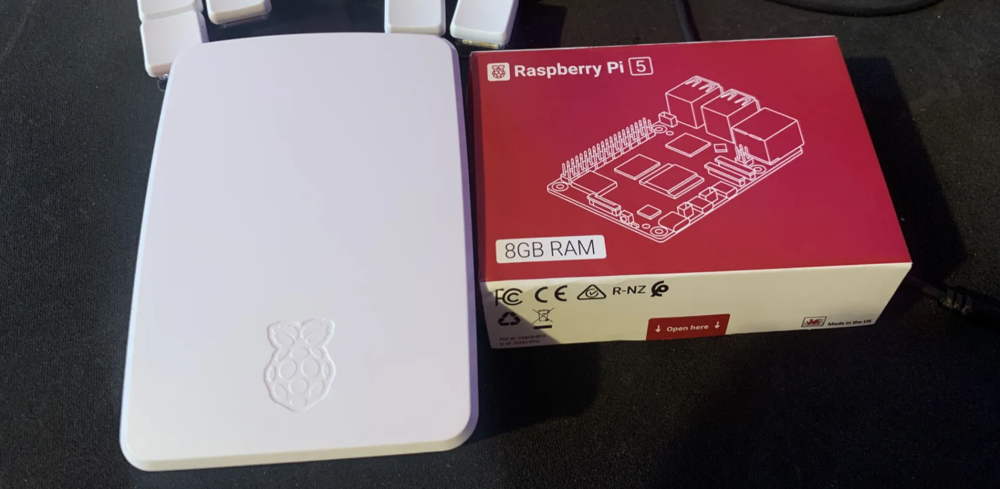

Desde siempre, como programador, tuve curiosidad por los servidores (o servers, que suena más cool). Pensaba que era algo raro lleno de cables que estaba en algún lugar etéreo de internet, que solo los backends y los expertos tenían acceso y lo entendían. Tiempo después, cuando me harté un poco del front-end, me propuse investigar qué tanto había con los servers, los errores 500, la infraestructura, la arquitectura y todo eso.

Lo único que tenía en la cabeza era que los servers eran pasillos llenos de racks con luces y cables. De ahí en más, quién sabe qué magia negra se gestaba para dar origen a internet.

### La curiosidad como caballo de batalla

Mi curiosidad me llevó a lugares raros e inhóspitos: terminales, protocolos, firewalls y un sinfín de cosas que no me hacían sentido. Tengo esta metodología mental de abstraer todo lo más posible para no caer en la locura. Me pasó con el front-end: algo como, el navegador es un programa que lee archivos `.html`, `.css`, `.js` y otros (así como Excel lee `.xlsx` o `.csv`). Simple y digerible. Los archivos de Excel tienen su forma de escribirse y el navegador tiene la suya: Excel tiene macros, celdas y columnas; el navegador tiene etiquetas, consola y un sinfín de cosas más. Quería que los servidores me hicieran el mismo sentido.

### Mi primer (caótico) acercamiento

Lo primero que hice fue meterme a AWS. Todos lo usaban (donde trabajo lo usaban hasta hace no mucho) y quería entender cómo funcionaba. Así que con un video de internet y un par de errores, levanté mi propio servidor, logré conectarme por SSH e instalar Apache para tener un servidor web.

Todo ese camino me enseñó lo básico: un server es un computador dentro de muchos computadores, montados en racks en data centers repartidos por varios países, con la diferencia de que esas máquinas no tienen monitores ni mouse, corren un sistema operativo mínimo (sin drivers de sonido, Bluetooth ni nada de eso) y te conectas por terminal con SSH. Desde ahí puedes hacer lo que quieras. Ahí aprendí a moverme entre archivos, instalar cosas y sentar las bases de lo que vendría después.

### No todo lo que brilla es oro, para tener oro tienes que pagarlo

Después de tener todo levantado, me di cuenta de que había que pagar si usaba ciertas cosas. En un momento dije: si se me olvida apagar algo, me van a cobrar. De entrada suena bien tener un server corriendo en AWS, pero cuando aparece la factura, es otra historia. En un descuido tuve que pagar como 50 USD.

Fue entonces cuando YouTube me recomendó un tema: los homelabs. Entre video y video, me di cuenta de que podía tener mi propio server casero sin pagar nada. No sonaba tan cool como "tengo un server en AWS", pero era gratis y podía hacer y deshacer a mi gusto.

### Raspberry Pi, el inicio de todo

Me compré una Raspberry Pi 5 y de ahí fue básicamente lo mismo que con AWS, solo que por mi cuenta. En AWS tienes varias ISOs para instalar el sistema operativo que quieras; acá era Ubuntu y punto. Eso hice: le metí Ubuntu Server, instalé Apache, puse un `index.html` y listo. Tenía todo lo que necesitaba para tener mi propio server casero.

Pasaron varias cosas después, como que el server murió porque instalé un programa corrupto, perdí todo y tuve que rehacer todo de nuevo. Pero de esos errores aprendí mucho más que viendo cualquier curso en internet.

### Conclusiones finales y la otra cara de la moneda

Finalmente entendí que un server no es magia oscura ni conocimiento reservado para unos pocos. Es un computador con un sistema operativo más simple, que cumple otra función, que en algunos casos requiere la terminal para hacer cambios, y que no es tan complicado como parece al principio.

En el proceso también aprendí a hacer algunos deploys automáticos con GitHub Actions, a usar Docker y a tener una primera pincelada de Kubernetes. No me volví experto, pero entendí lo suficiente como para no sentirme intimidado por ese lado. Y hasta hoy sigo aprendiendo y experimentando. Puedo borrar, reinstalar y volver a empezar, y eso es lo que más me gusta: no tenerle miedo a romper algo, porque siempre se puede volver a empezar.
