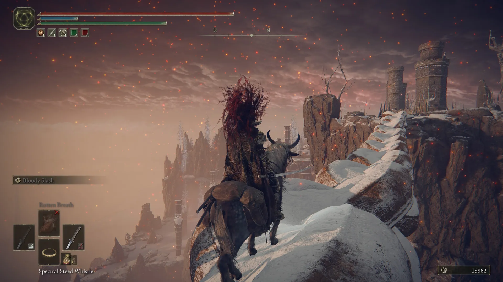

Hice todo lo que me dieron las ganas y el tiempo, quizás demasiado, para lo que venía después. Mi plan era simple: usar lo que el juego me daba, no complicarme tanto con builds y subir lo que tuviera a mano. Si bien Elden Ring presenta cientos de opciones para diferentes clases, al venir de Bloodborne quise simplificar todo y que mi experiencia se basara más en aprender movimientos que en optimizar al personaje.

### Una sensación difícil de explicar

Mientras avanzaba, explorar tenía sentido. Subía de nivel, mejoraba las armas, conseguía talismanes, lágrimas para el Physick, invocaciones (la mayoría inútiles) y un montón de objetos que prometían hacerme más fuerte. El juego constantemente me premiaba por desviarme del camino principal.

Pero cuando llegué al tramo final, esa sensación empezó a desaparecer.

Sentí que todo el progreso del personaje empezó a importar mucho menos que mi capacidad para memorizar patrones y ejecutar la pelea casi perfecta. Y ahí fue donde empecé a compararlo con Bloodborne.

### Bloodborne nunca me cambió las reglas

En Bloodborne aprendí algo simple desde el principio: la habilidad importaba, pero el personaje también. Si mejoraba el arma o subía de nivel, se notaba. Después de derrotar al Huérfano de Kos, a Gehrman y a la Presencia Lunar, sentí que cada hora invertida, cada mejora del personaje, había llegado a un punto culminante. El esfuerzo se reflejaba en el resultado.

Con Elden Ring no me pasó lo mismo.

### ¿Valió la pena explorar tanto?

Esa fue la pregunta que me quedó dando vueltas después de los créditos.

Pasé muchas horas explorando para que mi personaje fuera tan sólido que recibir golpes no fuera tan determinante. Era un trato implícito con el juego: te doy tiempo y dedicación, y a cambio no quiero que mi personaje muera en los primeros dos golpes. El juego me llevó en esa dirección y yo la seguí.

El problema es que Malenia, Radagon y la Elden Beast ignoraron ese trato por completo. Tres jefes que exigían precisión casi perfecta, independientemente de cuánto nivel o cuántas horas tuvieras encima. Todo el progreso acumulado dejó de importar.

### No quería que el juego fuera fácil, solo que fuera claro con las reglas

Si me pones un mundo abierto donde me estás diciendo que suba de nivel, encuentre mejores items y explore, y al final me pones tres jefes que invalidan ese progreso, quizás desde el principio debiste darle más peso a la habilidad que a la exploración.

Es frustrante no haber practicado ciertos patrones de combate porque tu personaje era suficientemente fuerte, y que al final el juego cambie las reglas del partido. Subir de nivel dejó de tener sentido cuando un NPC te mata de dos golpes sin importar cuánto hayas invertido.

Me sentí engañado por un juego que te guía en una dirección y al final descarta esa dirección.

### En fin

Quizás me apresuré en jugar otro Souls, o quizás este juego simplemente no era para mí en este momento. Sigo pensando que Bloodborne tuvo las reglas claras desde el inicio y las mantuvo hasta el final. Con Elden Ring no fue así, y el mal trago de haber invertido tanto para que al final nada de eso importara hizo que la chispa que traía de Bloodborne se apagara un poco.

No es un mal juego. Pero sí fue una mala despedida.

